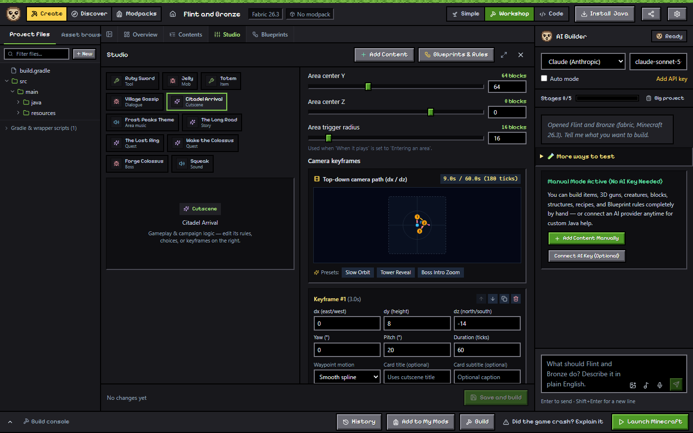
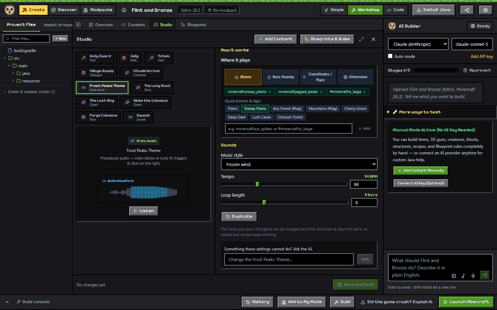
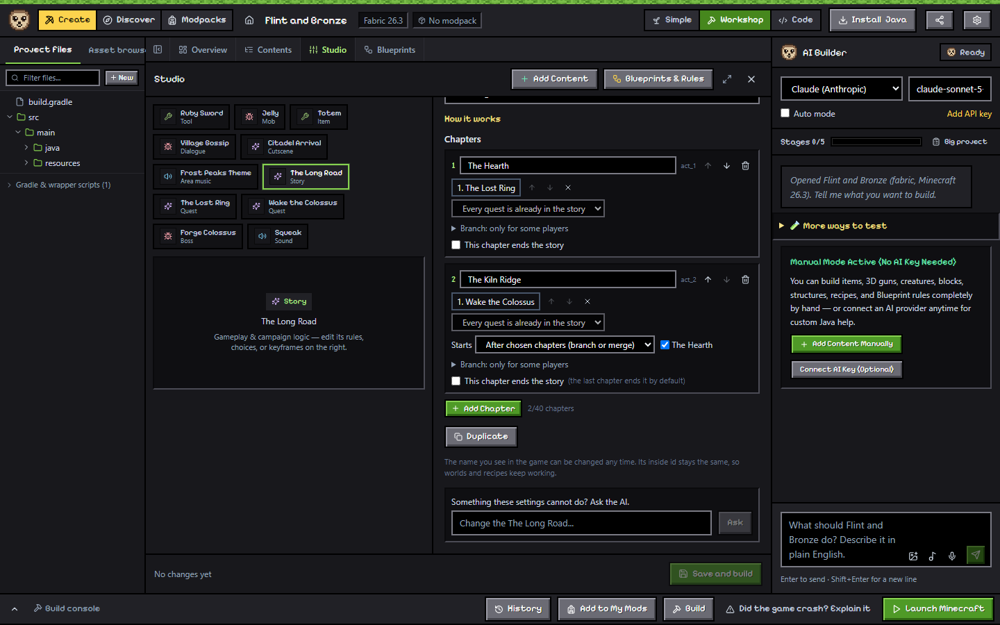
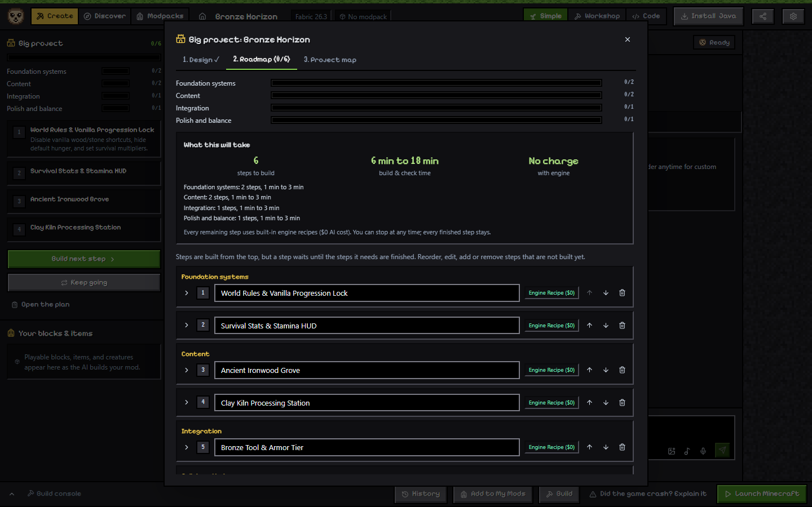
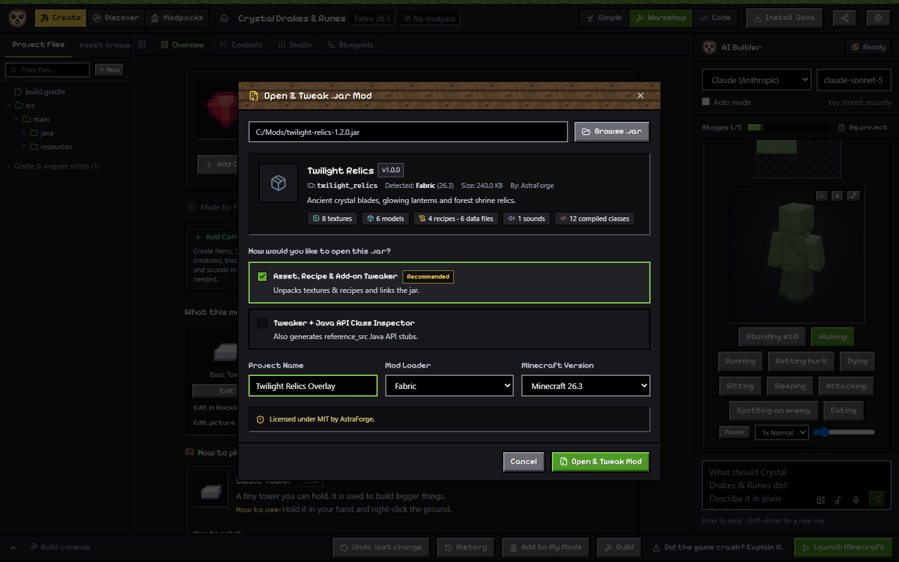
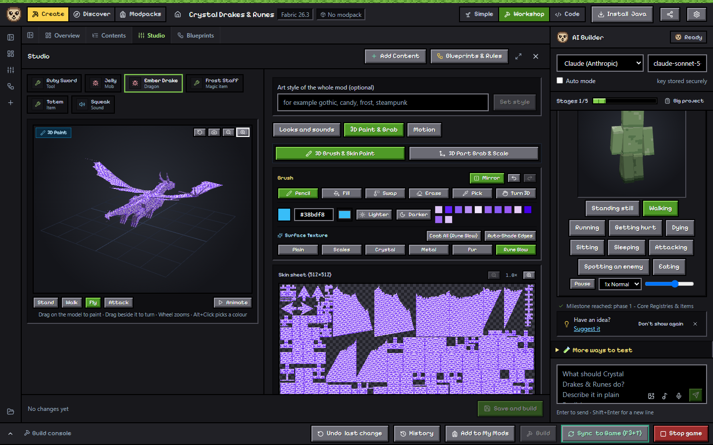
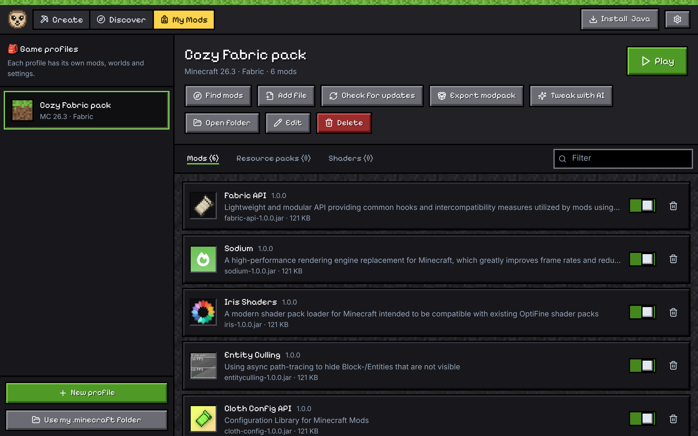

<h3>Describe a Minecraft mod in plain English. Sloth-Mod plans it, writes it, builds it and gets it ready to play — then lets you sculpt, paint and wire it by hand.</h3>

Free for Windows · works with any AI, cloud or local · no coding required, full Studio & Code mode included

[Website](https://deusespr.github.io/Sloth-Mod/) · [New in 1.7](#new-in-17) · [Showcase](#showcase) · [First mod in 3 steps](#your-first-mod-in-3-steps) · [Versions and AIs](#what-it-works-with) · [Install](#install) · [Help](#help-and-feedback) · [Support](#support-sloth-mod)

 

## What it does

- **Builds mods, RPG campaigns and full survival overhauls — from a sentence or at zero AI cost.** Describe items, blocks, creatures, bosses, combat systems or a themed world for the AI to plan and build, run any of the eight campaign-complete **Instant Overhaul Worlds** step by step with zero AI calls, or use **Build Manually** / **Add Content** and **Duplicate** offline with no API key.
- **Directs branching dialogue, camera cutscenes, quests & procedural music.** Give NPCs and villagers branching conversation trees with hub loops, flags, item gifts/trades, quests and faction reputation, stage smooth camera cutscenes with letterbox bars and title cards, wire multi-chapter quest storylines, and create seamless looping area and boss soundtracks right inside the app.
- **Reshapes vanilla rules, workstations & custom trees.** Disable chosen vanilla recipes, empty or override loot tables, remove mob spawns or worldgen ores, lock items behind progression gates, tune hearts and damage multipliers, add custom furnace-style kilns and processing stations with beveled vanilla-style GUIs, and grow sapling-to-canopy trees with plank, stair, slab, fence, fence gate, door, trapdoor, button and pressure plate wood sets.
- **Draws the art and makes the sounds.** A built-in engine makes the textures, 3D models, creature skins, procedural music loops and sound effects across 614 sound types. Pick your favourite version of each, then refine anything in the docked **Studio** without spending AI tokens.
- **Reopens `.jar` mods & exports Overlay Packs.** Click **Open `.jar` Mod** to reopen any `.jar` built by Sloth-Mod (`1.5.0+`) with its full project, custom art, Blueprints and code intact (with an opt-in per-mod switch if you also want to share your Big Project plan), or open another Fabric, NeoForge or Forge `.jar` to tweak its textures, sounds and recipes and export a clean `.zip` Overlay Pack.
- **Hands-on 3D Studio, Visual Blueprints & Code mode.** Paint pixels directly onto 3D models with smart material brushes and live 2D UV sync, grab and scale creature parts, edit 3x3 crafting grids with real Minecraft icons, wire game logic as visual Blueprint node graphs (or plain sentences), or open full **Code** mode with Java syntax highlighting.
- **Lets you test before anything is kept.** One button starts Minecraft with your mod, and **Sync to Game (`F3+T`)** pushes live art tweaks into a running test session. Keep it, ask for a fix or undo it.
- **Manages your mods too.** Browse Modrinth, install mods, modpacks, resource packs and shaders, and keep game profiles for Fabric, Quilt, Forge, NeoForge and vanilla.

## New in 1.7

<table>
  <tr>
    <td width="50%" valign="top"> <b>Branching Dialogue Trees (<code>$0</code> AI).</b> Give custom NPCs or vanilla villagers branching conversations with up to 48 nodes, hub loops, flags, item gifts/trades, quests and reputation.</td>
    <td width="50%" valign="top"> <b>Camera Cutscenes.</b> Stage smooth curved or straight camera paths with letterbox bars, title cards, Skip button, and automatic camera restore across all 6 targets.</td>
  </tr>
  <tr>
    <td width="50%" valign="top"> <b>Procedural Area &amp; Boss Music.</b> Create click-free looping instrumental tracks right inside the app across 8 styles and play them by boss, place, biome or dimension priority.</td>
    <td width="50%" valign="top"> <b>Campaign Studio &amp; 8 Campaign Overhauls.</b> Edit quests, multi-chapter storylines, factions and boss phases visually in Studio, and run all 8 Instant Overhaul Worlds with a zero-AI Campaign finale.</td>
  </tr>
</table>

- **Branching Dialogue Trees & Talking Characters (all 6 targets, `$0` AI).** Pick **Dialogue Character** or **Villager Conversation** in **Build Manually** (or open any NPC in **Studio**) for branching conversations with up to 48 nodes and 4 choices per node, hub loops, story-flag show/hide conditions, item requirements, item gifts/trades (with automatic once-per-player protection on free item rewards), quest starts, faction reputation changes, Blueprint triggers and NPC trade-window openers — editable in Studio's visual dialogue graph and trades editors.
- **Camera Cutscenes (all 6 targets, `$0` AI).** Pick **Camera Cutscene** in **Build Manually** to direct smooth curved, straight, ease-in or ease-out camera paths (up to 24 keyframes, `+-48` block offsets, up to `60s`), optional letterbox bars, title and subtitle cards, `Esc` / **Skip**, triggers on first world join, entering an area, quest or dialogue story hooks, or `/sloth cutscene play <id>`, automatic camera and HUD restore if hurt or disconnected, and Studio camera path presets (**Slow Orbit**, **Tower Reveal**, **Boss Intro Zoom**).
- **Procedural Area & Boss Music (all 6 targets, `$0` AI).** Pick **Area & Boss Music** in **Build Manually** to create seamless looping instrumental tracks right inside the app across eight styles (**Frozen wind**, **Hearth calm**, **Ash drums**, **Deep choir**, **Star chimes**, **Brass tick**, **Court strings** and **Woodland flute**) with configurable tempo (`56-156 BPM`), length (`4-16` bars) and volume, played in-game by priority (**Boss Nearby** > **Coordinates / Place** > **Biome** > **Dimension**) with live Studio waveform preview.
- **Campaign Studio Editors, Manual Starters & 8 Campaign-Ready Instant Overhaul Worlds.** Edit quest steps, rewards and prerequisites, multi-chapter storylines (**Create Storyline from Quests**), faction rosters and boss phases in Studio, add **Quest & Objectives**, **Faction & Reputation** and **Settlement / Village** from **Build Manually**, enjoy beveled vanilla-style workstation GUIs on new stations, and build all eight **Instant Overhaul Worlds** with a zero-AI **Campaign** milestone (faction, talking guide with trades, quests, storyline, arrival cutscene and biome music).
- **Still being polished.** All six targets build `.jar` files and pass server checks (and Fabric `26.3` has been verified in a live client), while full interactive playthroughs of the new dialogue screens, camera cutscenes, area music and beveled workstation windows across every loader and multiplayer are brand new — use **Report a problem** inside the app if something acts up.

### Also in 1.6, 1.5 & 1.4

<table>
  <tr>
    <td width="50%" valign="top"> <b>World Rules, Workstations &amp; Custom Trees (<code>1.6</code>).</b> Reshape vanilla recipes, progression gates, loot &amp; spawns, add furnace-style kilns with GUIs, and grow custom trees with plank wood sets across all 6 targets.</td>
    <td width="50%" valign="top"> <b>8 Instant Overhaul Worlds (<code>$0</code> AI, <code>1.6</code>–<code>1.7</code>).</b> Pick any of the eight built-in survival overhauls and build every step straight from engine recipes with zero AI calls and opt-in <code>.jar</code> plan sharing.</td>
  </tr>
  <tr>
    <td width="50%" valign="top"> <b>Open <code>.jar</code> Mods &amp; Export Overlay Packs (<code>1.5</code>).</b> Reopen any Sloth-Mod <code>1.5.0+</code> <code>.jar</code> as a full editable project, or tweak another Fabric, NeoForge or Forge <code>.jar</code> into a clean <code>.zip</code> Overlay Pack.</td>
    <td width="50%" valign="top"> <b>Docked 3D Studio, Blueprints &amp; Code Mode (<code>1.4</code>–<code>1.5</code>).</b> Paint directly on 3D models with smart material brushes, wire <code>If / Else</code> &amp; <code>For Each</code> Blueprint graphs, craft 3x3 recipes, or code in Java.</td>
  </tr>
</table>

- **World rules, custom kilns, plank wood-set trees & 8 Instant Overhaul Worlds (`1.6`).** Disable vanilla recipes/ores/spawns, gate items behind progression, build custom workstations and sapling-to-canopy trees across all 6 targets, run zero-AI survival conversions, and keep Big Project plans private in `.jar` bundles unless opted in.
- **Zero-token Manual Creator & Duplicate, `.jar` round-trip, Overlay Packs & action combat (`1.4`–`1.5`).** Create and clone content offline, reopen Sloth-Mod `.jar` projects, export `.zip` Overlay Packs, sync live art via `F3+T`, and build dodge rolls, timed parries, radial spell wheels, passive skill trees and multi-move bosses.

## Showcase

Everything here was drawn by Sloth-Mod's own art engine, the one that makes the art in your mods. No image generator, no Minecraft art, nothing touched up by hand. You can turn each one yourself, and hear the sound maker, on the [website](https://deusespr.github.io/Sloth-Mod/#showcase).

<table>
  <tr>
    <td width="50%" align="center"> <b>Tools and weapons</b></td>
    <td width="50%" align="center"> <b>Guns</b></td>
  </tr>
  <tr>
    <td colspan="2" align="center"> <b>Blocks</b></td>
  </tr>
</table>

 
<b>Every item shape the engine knows.</b> You choose the material and the colors.

 
<b>Every block material the engine knows</b> (with separate tops for logs, bone and grass). They tile without seams.

### Creatures and bosses in Minecraft

 
<b>Five dragons.</b> On the <a href="https://deusespr.github.io/Sloth-Mod/#creatures">website</a> you can look at dragons and a fairy from four sides.

<table>
  <tr>
    <td width="50%" align="center"> <b>A fairy with butterfly wings</b></td>
    <td width="50%" align="center"> <b>A dragon with membrane wings</b></td>
  </tr>
  <tr>
    <td width="50%" align="center"> <b>Leathery and feathered wings</b></td>
    <td width="50%" align="center"> <b>Multi-part bosses, archers and sentinels in 26.3</b></td>
  </tr>
</table>

## Your first mod in 3 steps

1. **Describe it.** Click **Create New Mod**, pick a Minecraft version and type what you want, for example "a ruby sword that sets mobs on fire". Sloth-Mod asks a few clickable questions and shows a plan.
2. **Pick and customize the art.** Choose from several versions of each texture, 3D model and sound — or jump into **Studio** and **Blueprints** to paint in 3D, tweak parts, edit crafting recipes and wire rules by hand.
3. **Test it in Minecraft.** One button starts the game with your mod. Then answer "Did it work?": keep it, say what is wrong so the AI fixes it, or undo.

<table>
  <tr>
    <td width="50%" valign="top"> <b>A plan you approve.</b> Nothing is built before you say so.</td>
    <td width="50%" valign="top"> <b>Pick your favourite.</b> The others are kept for later.</td>
  </tr>
  <tr>
    <td width="50%" valign="top"> <b>Ready for you to test.</b> Your mod is saved only when you keep it.</td>
    <td width="50%" valign="top"> <b>A player guide</b> with crafting panels drawn like the game.</td>
  </tr>
  <tr>
    <td width="50%" valign="top"> <b>Discover.</b> Mods, modpacks and shaders from Modrinth.</td>
    <td width="50%" valign="top"> <b>My Mods.</b> Game profiles, on/off switches, updates and Play.</td>
  </tr>
</table>

## What it works with

**Minecraft versions** it builds new mods for:

| Minecraft | Fabric | NeoForge | Forge |
|:---|:---:|:---:|:---:|
| 26.3 | ✓ | ✓ | |
| 1.21.1 | ✓ | ✓ | |
| 1.20.1 | ✓ | | ✓ |

Where new things land:

| | Versions | What to expect |
|:---|:---|:---|
| **New things first** | Fabric 26.3 | Everything new is built and proven here first |
| **Supported** | NeoForge 26.3 · NeoForge 1.21.1 · Forge 1.20.1 · Fabric 1.21.1 · Fabric 1.20.1 | Works and gets fixes; new things arrive in batches |
| **Legacy projects** | Fabric and NeoForge 26.1, 26.2 | Existing mods still open and move to 26.3 in one click |

Small updates arrive often; the app offers them by itself, and your mods, settings and keys stay as they are.

The right Java and Gradle are downloaded by the app. It never touches the Java on your PC. The mod manager also handles Quilt and vanilla profiles.

**AI providers.** Use the one you like:

| Kind | Providers |
|:---|:---|
| **Cloud** | Claude, OpenAI, Gemini, Grok, DeepSeek, Qwen, OpenRouter, Mistral, Groq, Kimi, GLM, MiniMax, Together, Fireworks, Cerebras, NVIDIA NIM, Hugging Face |
| **Local** | LM Studio, Ollama or any OpenAI-compatible server |

Your AI provider may charge you; Gemini and Mistral have free tiers, OpenRouter has free models, and a local AI costs nothing. Every provider has a **Get an API key** button with a note on cost, **Test this AI** checks that it can really drive the app, and you can set a spending limit.

## Install

1. Download [`Sloth-Mod_1.7.0_x64-setup.exe`](https://github.com/DeusesPR/Sloth-Mod/releases/download/v1.7.0/Sloth-Mod_1.7.0_x64-setup.exe) (or pick a version on the [releases page](https://github.com/DeusesPR/Sloth-Mod/releases)) and run it. It installs for your user only, with no admin prompt.
2. **Why Windows shows a warning.** Sloth-Mod is free and not paid-signed, so Windows SmartScreen may show a blue "Windows protected your PC" box. That is normal for a free app. Click **More info**, then **Run anyway**. Only do this for an installer from this repository's Releases page. More in [PRIVACY.md](PRIVACY.md) and [SECURITY.md](SECURITY.md).

You need Windows 10 or 11 (64-bit), about 4 GB of free disk space, internet for the first setup, and Minecraft Java Edition to play what you make. The app updates itself and keeps your mods, settings and keys.

## Where Sloth-Mod is going

Not available today, and built step by step: custom biomes, multi-biome dimensions with custom portals, multi-room branching dungeons, full free-hand 3D box adding and custom animation timelines in Studio, and making everything even easier on cheap and free AI. No dates, on purpose.

What stays: free, Windows, works with cheap or free AI (including AI on your own PC), a compatibility check against your modpack, and safety checks on AI-written code. If you use Sloth-Mod today, nothing breaks and updates keep coming through the app. Tell us what you want to make in the [Discussions](https://github.com/DeusesPR/Sloth-Mod/discussions), or use **Report a problem** in the app.

## Status

**What works in this version (1.7.0):** core mod recipes — including `1.7.0`'s **Branching Dialogue Trees**, **Camera Cutscenes**, **Procedural Area & Boss Music**, **Campaign Studio Editors** and campaign-complete **Instant Overhaul Worlds**, plus `1.6.0`'s **World Rules**, **Workstations** and **Custom Trees** — compile with real Gradle across all 6 active Minecraft/loader targets (`Fabric 26.3`, `NeoForge 26.3`, `Fabric 1.21.1`, `NeoForge 1.21.1`, `Fabric 1.20.1`, `Forge 1.20.1`), pass dedicated server startup checks (`Fabric 26.3`, `NeoForge 26.3`, `NeoForge 1.21.1`, `Forge 1.20.1`), and are checked in a live Minecraft `Fabric 26.3` client session alongside `1.5.0`'s **Open `.jar` Mod** restore and `.zip` Overlay Pack export; the docked Studio (`Looks and sounds`, `3D Paint & Grab`, `Motion`, `Parts`, `3x3 Crafting`, dialogue node graphs, camera splines, music triggers and campaign editors), `Blueprints & Rules`, **Sync to Game (`F3+T`)**, `Code` mode, sound maker and `Share` showcase cards all work offline without spending AI tokens.

**Still being polished:** some of the newest campaign, cutscene, dialogue, action-combat, spell-wheel, skill-tree and multi-move boss options have not been played in large multiplayer sessions yet, HUD-bar hiding and damage multipliers in **World Rules** are skipped on `Fabric 1.20.1` and `Fabric 1.21.1`, and third-party `.jar` tweaking intentionally edits textures, sounds, recipes and data rather than decompiling compiled Java classes. The safety check is a strong guardrail, not a guarantee: only play mods you trust. The installer is not paid-signed, so Windows SmartScreen may show a warning.

## More details

<b>Everything it can do</b>

 

- **Describe, plan, build, test — or create manually.** Ask the AI to plan and build from plain English, or click **Build Manually** / **Add Content** and **Duplicate** to add and clone items, blocks, creatures, dialogues, quests, factions, settlements, cutscenes and area music offline at zero AI cost.
- **Branching dialogue, camera cutscenes, quests & procedural music.** Wire NPC and villager conversations with up to 48 nodes, hub loops, flags, item gifts/trades, quests and reputation, stage smooth curved or straight camera cutscenes with letterbox bars and title cards, arrange multi-chapter quest storylines, and create click-free looping area & boss tracks across 8 styles.
- **Reopen `.jar` mods & export Overlay Packs.** Click **Open `.jar` Mod** to restore any `.jar` built by Sloth-Mod (`1.5.0+`) into its full project, or open another Fabric, NeoForge or Forge `.jar` to customize textures, sounds and recipes and export a clean `.zip` Overlay Pack.
- **Art picker & docked 3D Studio.** Several different designs of every texture, 3D model and creature. Open **Studio** right inside the workspace to paint pixels directly onto the 3D surface with smart **Scales**, **Crystal**, **Metal**, **Fur** and **Rune Glow** brushes synced to the 2D UV sheet, grab and scale parts, adjust motion, or edit 3x3 crafting recipes with real Minecraft icons.
- **Visual Blueprints & Plain Sentences.** View and wire every mod rule as a colour-coded Blueprint node graph with `If / Else`, `Repeat`, `For Each`, `Random Pick`, `Chance Roll` and `Wait (Delay)` nodes, spawn nodes quickly by double-clicking empty grid space or dragging a pin, flip to plain-English sentences anytime, or ask AI to wire a rule.
- **Code mode.** Open any mod or existing Fabric, NeoForge or Forge Gradle folder in **Code** mode with dark-theme Java, JSON and Gradle syntax colouring, file search, one-click JAR builds and side-by-side file AI help.
- **Sound & music maker.** 614 kinds of sound (creatures, weapons, magic, materials, machines, interface, ambience, music) plus 8 seamless area & boss music loop styles, made in the app, checked for clicks and clipping, and added as real mod sounds.
- **How-to-play guides.** Every mod gets a player guide with crafting panels, drop and spawn info, ready-to-paste commands and a mod icon.
- **Action combat, magic & bosses.** Dodge rolls, timed parries, radial spell wheels with three loadouts, 3D hand-held staffs, passive skill-tree windows, multi-move bosses with breakable parts, watched stalkers, ranged mobs and custom ore veins.
- **Update to a new Minecraft version.** One run moves your mod to a newer version of the same loader (or Forge to NeoForge) and keeps your art, sounds and hand edits.
- **Big project mode & 8 Instant Overhaul Worlds.** An approved design, a 20 to 50 step roadmap and a project map built one tested step at a time — or pick any of the eight built-in **Instant Overhaul Worlds** (`$0` AI) to build a campaign-complete survival conversion step by step with zero AI calls.
- **World rules, custom workstations & plank wood-set trees.** Disable vanilla recipes, empty or override loot tables, remove mob spawns or worldgen features, lock items behind progression gates, add furnace-style kilns and processing stations with beveled GUI windows, and grow sapling-to-canopy custom trees with plank wood families.
- **Add-ons.** Make a mod that builds on another mod from Modrinth.
- **Spending limit.** Per-mod and daily limits with an optional PIN, and a cost readout for every run.
- **Mod manager.** Modrinth search and installs, game profiles, updates, `.mrpack` export, and Play through the official launcher.
- **Modpack compatibility check.** A throwaway server tells you whether your new mod works with the pack's mods.
- **Crash explainer, version history, share and publish** (export a `.jar` with a readme, save a `1200x630` showcase banner card, copy a Discord/Markdown post, or publish a draft to Modrinth).

<b>Safety and privacy</b>

 

- **A guard reads mod code, metadata and build files.** Before every build, code as well as mod metadata and resource files are scanned for things a mod should never do, like launching programs, opening web connections, running hidden commands during a build or touching files outside the game folders. The build files are locked while a mod is made, and a blocked build tells you why.
- **Nothing is kept until you say so.** The AI works on a copy of your mod. You test it, then keep or undo. Older versions stay in History.
- **No accounts, no tracking.** No sign-up, no telemetry, no analytics. Built `.jar` files include a small project bundle (your mod's own source, textures, sounds and Blueprints, with no API keys, chat history or PC folder paths; your Big Project plan stays out unless you switch it on for that mod) so you or anyone you share the `.jar` with can reopen it in Sloth-Mod, plus an optional "Made with Sloth-Mod" credit line you can switch off in Settings. Your requests and mod files go only to the AI provider you choose, or nowhere with a local AI. Downloads contact Modrinth, Mojang and the loader sites, and the update check contacts GitHub. If "Let the AI look things up online" is on (the default), the AI may read a short summary from Wikipedia or the Minecraft wiki while planning. The full list is in [PRIVACY.md](PRIVACY.md).
- **Keys stay on your PC.** API keys live in Windows Credential Manager, never in files or logs. Sloth-Mod never sees your Microsoft login; the official launcher handles it.
- **Honest limits.** Mods are programs and the guard is a safety net, not a guarantee. Code that passes the guard still runs with your Windows rights. Only play mods you trust. How to report a security problem: [SECURITY.md](SECURITY.md). Terms in plain words: [DISCLAIMER.md](DISCLAIMER.md).

<b>Questions and answers</b>

 

**Is it free?** Yes. Free to download and use, and the mods you make are yours ([terms](LICENSE)). Your AI provider may charge; free tiers, OpenRouter's free models and local AIs exist.

**Do I need to code?** No. You describe what you want (or use **Build Manually** / **Add Content**), click through a few choices, and customize looks, parts, crafting and Blueprints visually. If you do like code, **Code** mode and Workshop view give you a syntax-coloured Java editor, diffs and one-click Gradle builds.

**Which AI should I use?** Any listed provider. Bigger models make bigger mods with fewer repairs. **Test this AI** in Settings checks yours.

**Is the Windows warning normal?** Yes. Sloth-Mod is free and not paid-signed, so Windows warns about it like any new app. Make sure you downloaded it from this repository's [Releases page](https://github.com/DeusesPR/Sloth-Mod/releases/latest).

**Mac or Linux?** The installer is Windows only.

**Is this an official Minecraft product?** No. It is a fan-made tool, not approved by or associated with Mojang or Microsoft, and it contains no Minecraft assets.

Longer answers are on the [website](https://deusespr.github.io/Sloth-Mod/#faq).

<b>What has been tested, and what has not</b>

 

- Tested on a real Windows PC with real cloud and local AIs: AI-built mods from plain sentences were built with real Gradle, checked on dedicated servers (`Fabric 26.3` and `NeoForge 26.3`) and played in a real Minecraft client window (`Fabric 26.3`), alongside quick edits, Undo and Share; `1.7`'s **Branching Dialogue Trees**, **Camera Cutscenes**, **Procedural Area & Boss Music** and campaign-complete **Instant Overhaul Worlds** were built with real Gradle across all six active targets (`Fabric 26.3`, `NeoForge 26.3`, `Fabric 1.21.1`, `NeoForge 1.21.1`, `Fabric 1.20.1`, `Forge 1.20.1`), started on dedicated servers (`Fabric 26.3`, `NeoForge 26.3`, `NeoForge 1.21.1`, `Forge 1.20.1`) and checked in a live Minecraft `Fabric 26.3` client session alongside `1.6`'s **World Rules**, **Workstations** & **Custom Trees** and `1.5`'s **Build Manually**, **Duplicate**, **Open `.jar` Mod** project restore & Overlay Pack `.zip` export.
- 1.4 through 1.7: branching NPC & villager dialogue, camera cutscenes, seamless procedural area & boss music, campaign Studio editors, survival world rules, custom GUI workstations, full wood-set trees, zero-AI overhaul roadmaps, `.jar` round-trip restore, Overlay Pack export, Manual Creator, Duplicate, docked 3D Studio, action combat, spell wheels, passive skill trees, multi-move bosses with breakable parts, watched stalkers, ranged mobs, ore veins, articulated dragon/bat/feathered wings and grounded serpents are verified in real builds and client/server checks, while multiplayer and older-target gameplay edge cases are still being fine-tuned in real play.
- "Sign in with Grok" is experimental and off by default (Settings → Experimental). It signs in with the identity of xAI's own Grok CLI, which may be against xAI's terms; xAI can block it or act on your account. You must accept a warning first, and an xAI API key is the supported way.
- The installer is not paid-signed.

## Help and feedback

- **Something broke?** Press **Report a problem** in the app; it fills in a GitHub issue with your log attached and your keys and Windows name hidden. Or open a [bug report](https://github.com/DeusesPR/Sloth-Mod/issues/new?template=bug_report.yml) by hand. Never paste API keys.
- **Ideas, questions and things you built:** [suggest an idea](https://github.com/DeusesPR/Sloth-Mod/issues/new?template=mod_idea.yml) (or press **Suggest an improvement** in the app) or join the [Discussions](https://github.com/DeusesPR/Sloth-Mod/discussions).
- **Want to help?** Reports and ideas are the best help right now; the [changelog](CHANGELOG.md) shows what changed.

## Support Sloth-Mod

Sloth-Mod is free. If it helps you, you can support it here: **[buymeacoffee.com/SlothMod](https://buymeacoffee.com/SlothMod)**

## License and credits

Sloth-Mod is free to use; the terms are in [LICENSE](LICENSE) (versions up to 1.1.1 were released under the MIT license). The source code is not published from 1.1.2 on. Everything Sloth-Mod is built from is listed in [THIRD_PARTY_LICENSES.md](THIRD_PARTY_LICENSES.md). The pixel fonts are Pixelify Sans and VT323 (SIL OFL 1.1), and the bundled sound library is CC0 sound effects by [Kenney](https://www.kenney.nl). All art in the app and on this page is original or made by the app's own art engine.

Sloth-Mod is not an official Minecraft product and is not approved by or associated with Mojang or Microsoft. Minecraft is a trademark of Mojang AB and Microsoft Corporation, used here only to name the game the mods are for. Sloth-Mod contains no Minecraft assets; pictures of vanilla items are read at run time from your own game files.
